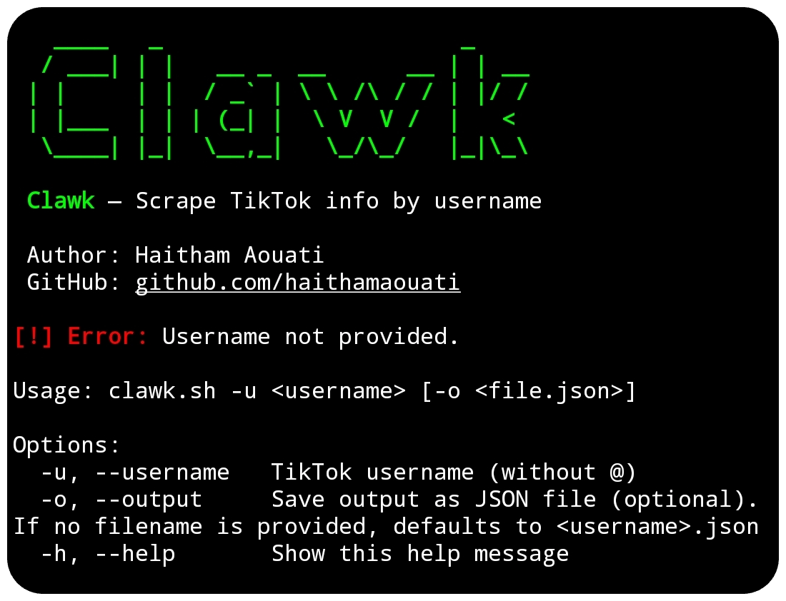
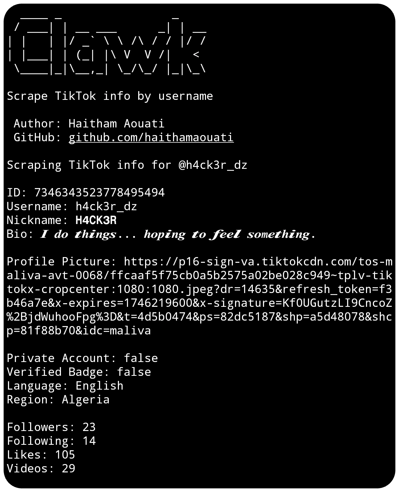

# Clawk
Scrape TikTok user info by username.



## Install

To use the Clawk script, follow these steps:

1. Clone the repository:

    ```
    git clone https://github.com/haithamaouati/Clawk.git
    ```

2. Change to the Clawk directory:

    ```
    cd Clawk
    ```
    
3. Change the file modes
    ```
    chmod +x clawk.sh
    ```
    
5. Run the script:

    ```
    ./clawk.sh
    ```

## Usage

Usage: `./clawk.sh -u <username>`

##### Options:

`-u`, `--username`   TikTok username (without @)

`-o`, `--output`     Save output as JSON file (optional). If no filename is provided, defaults to `<username>.json`

`-h`, `--help`       Show this help message

## Screenshot


## Dependencies

The script requires the following dependencies:

- **figlet**: `pkg install figlet - y`
- **curl**: `pkg install curl - y`
- **jq**: `pkg install jq`

Make sure to install these dependencies before running the script.

## Disclaimer
> [!WARNING]
> We are not responsible for any misuse or damage caused by this program. use this tool at your own risk!

## License

Clawk is licensed under [WTFPL license](LICENSE).
