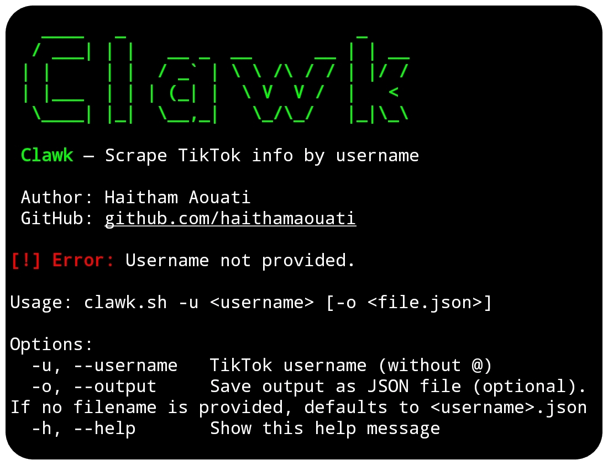

# Clawk
**Clawk** is an OSINT (Open Source Intelligence) tool designed to fetch detailed profile data from TikTok without using an official API or requiring user authentication. It targets the "no-login" barrier effectively, making it very useful for researchers or developers.

<p align="center">
  



## Features

- Fetch user information by TikTok `username`.
- Works without logins and without using APIs.
- Extracts:
  - User ID
  - Unique ID
  - Nickname
  - Follower count
  - Following count
  - Likes count
  - Video count
  - Biography (signature)
  - Verified status
  - SecUid
  - Comment settings
  - Private account status
  - *~Region~* (Try web version: [TikToker](//haithamaouati.github.io/TikToker/)
  - Heart count
  - Digg count
  - Friend count
  - Account created
  - Last username change
  - Last nickname change
  - TikTok profile URL

## Install

To use the Clawk script, follow these steps:

1. Clone the repository:

    ```
    git clone https://github.com/haithamaouati/Clawk.git
    ```

2. Change to the Clawk directory:

    ```
    cd Clawk
    ```
    
3. Change the file modes
    ```
    chmod +x clawk.sh
    ```
    
5. Run the script:

    ```
    ./clawk.sh
    ```
## Usage

Usage: `./clawk.sh <@username>` or `[username]`

## Dependencies
The script requires the following dependencies:

- **curl**: `pkg install curl - y`
- **jq**: `pkg install jq -y`

> [!IMPORTANT]  
> Make sure to install these **dependencies** before running the script.

> [!NOTE]  
> Ensure that the TikTok user account is public to access their information.

> [!TIP]
> The scraping technique relies on the current structure of the TikTok website, which may change.

## Environment
- Tested on [Termux](https://termux.dev/en/)

## Disclaimer
>[!CAUTION]
>This Tool is only for educational purposes

> [!WARNING]
> We are not responsible for any misuse or damage caused by this program. use this tool at your own risk!

## Star History

[](https://www.star-history.com/#haithamaouati/Clawk&type=date&legend=top-left)

#### Find this repository useful? ♥️
Support it by joining the [stargazers](https://github.com/haithamaouati/Clawk/stargazers). ⭐

If you want to help even more, please spread the word — share the project on X, Reddit, or with your community so more people discover it.

And [follow me](https://github.com/haithamaouati) to keep up with future updates and projects. 🤩


## License

Clawk is licensed under [WTFPL license](LICENSE).
