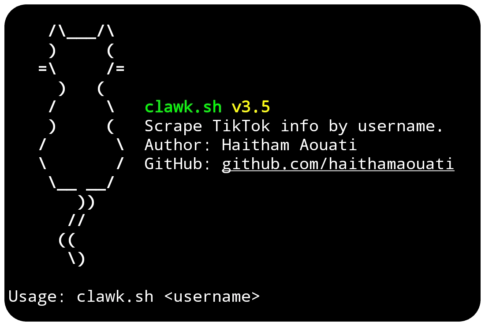

# Clawk
Scrape TikTok user info by username.



## Install

To use the Clawk script, follow these steps:

1. Clone the repository:

    ```
    git clone https://github.com/haithamaouati/Clawk.git
    ```

2. Change to the Clawk directory:

    ```
    cd Clawk
    ```
    
3. Change the file modes
    ```
    chmod +x clawk.sh
    ```
    
5. Run the script:

    ```
    ./clawk.sh
    ```

## Usage

   ```
   Usage:  /clawk.sh -u <username>
   ```

##### Options:

`-u`, `--username`   TikTok username (without @)

`-h`, `--help`       Show this help message

## Screenshot


## Dependencies

The script requires the following dependencies:

- [figlet](): `pkg install figlet - y`
- [curl](https://curl.se/): `pkg install curl - y`
- [jq](https://stedolan.github.io/jq/): `pkg install jq`

Make sure to install these dependencies before running the script.

## Author

Made with :coffee: by **Haitham Aouati**
  - GitHub: [github.com/haithamaouati](https://github.com/haithamaouati)

## License

Clawk is licensed under [MIT License](LICENSE).
